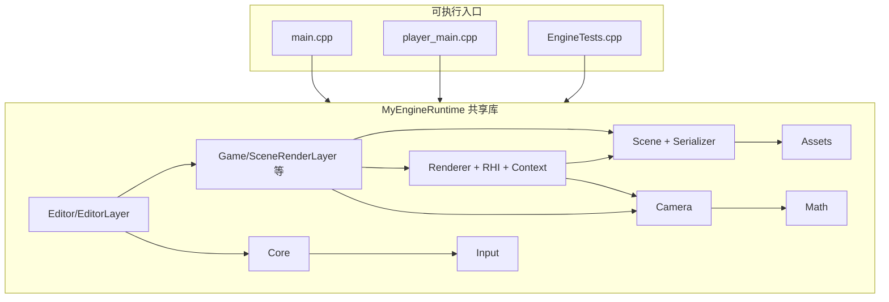
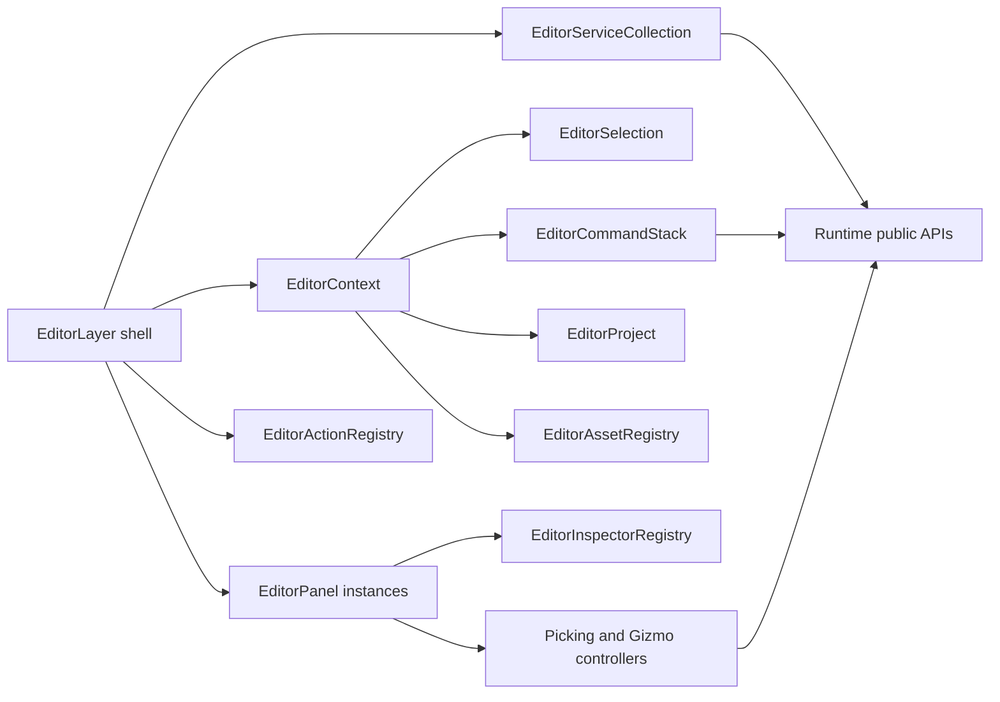

# MyEngine 架构说明

本文档描述当前仓库的 **目录结构**、**构建目标**、**源码模块划分** 以及 **模块间依赖关系**。若与实现不一致，以 `xmake.lua` 与源码为准。

---

## 1. 仓库与目录结构

```
MyEngine/
├── xmake.lua                 # 工程与目标定义
├── xmake/imgui_metal.lua     # macOS：ImGui + Metal 辅助目标（imgui_metal）
├── main.cpp                  # 编辑器入口：SDL3 + Application，推入 SceneRenderLayer 与 EditorLayer
├── player_main.cpp           # 运行时入口：仅 SceneRenderLayer（无编辑器 UI）
├── design.md                 # 本文档
├── Content/                  # 游戏内容（构建后复制到输出目录）
├── tests/
│   └── EngineTests.cpp       # 单元测试（序列化、Transform、Input、资源导入等）
├── thirdparty/
│   └── ImGuizmo/             # 场景视口 Gizmo（与 ImGui 配合）
└── src/
    ├── Runtime/
    │   ├── Core/             # Application、Engine、Window、Event、Layer、LayerStack、Time、Logger、Platform、EngineMath
    │   ├── Input/            # 输入快照（与 Engine 事件循环配合）
    │   ├── Audio/            # miniaudio 后端、音频资源、AudioSource 组件
    │   ├── Math/             # Vector/Quaternion/Mat4/Color/Ray/AABB 等；Mat4Inverse 实现
    │   ├── Assets/           # AssetManager、导入器；Mesh/Material/Texture/Model 资产类型
    │   ├── Scene/            # Scene、Actor、Transform、组件、SceneSerializer（JSON）
    │   ├── Camera/           # 相机（透视/正交；与 SceneRenderLayer 中飞行/轨道逻辑配合）
    │   ├── Renderer/         # IRenderContext、Renderer、MainPass、ShadowPass、平台 Context 实现
    │   │   └── RHI/          # GpuBuffer、GpuTexture、GpuShader、SwapChain 等抽象
    │   ├── Game/             # SceneLayer、SceneRenderLayer、GameLayer、TriangleLayer（示例/遗留层）
    │   └── RuntimeModule.cpp # 仅占位，保证共享库至少有一个翻译单元
    └── Editor/
        └── EditorLayer.*     # ImGui：工具栏、Outliner、Scene View、Inspector、日志、资源浏览器等
```

---

## 2. 构建目标与第三方依赖

### 2.1 xmake 目标

| 目标 | 类型 | 说明 |
|------|------|------|
| `MyEngineRuntime` | `shared`（`runtime.dll`/`libruntime.so` 等） | 聚合 **Runtime** 全部 `.cpp`、**EditorLayer**、`ImGuizmo`；对外导出 `src/Runtime/**/*.h`（public include） |
| `MyEngineEditor` | `binary` | 链接 `MyEngineRuntime`，入口 `main.cpp`；规则 `copy_game_content` |
| `MyEnginePlayer` | `binary` | 链接 `MyEngineRuntime`，入口 `player_main.cpp`；同样复制 `Content` |
| `MyEngineTests` | `binary` | 链接 `MyEngineRuntime`，`tests/EngineTests.cpp`；运行时仍依赖 SDL（链接与 DLL 复制与编辑器类似） |

**说明**：编辑器 UI 并非独立静态库，而是 **编译进 `MyEngineRuntime` 共享库**；可执行文件只负责入口与 `PushLayer` 组合。`MyEnginePlayer` 虽不推入 `EditorLayer`，仍定义 `MYENGINE_ENABLE_IMGUI`（与 `xmake.lua` 一致），便于将来或工具链统一。

### 2.2 第三方包（`add_requires`）

| 包 | 用途 |
|----|------|
| **libsdl3** | 窗口、事件、文件对话框、时间；与 ImGui 的 SDL3 后端一致（需统一 shared，避免重复符号） |
| **imgui** | 编辑器 UI；Windows 配置含 `dx11`/`dx12` 后端；macOS 通过 `imgui_metal` 与 Metal 集成 |
| **nlohmann_json** | `SceneSerializer` 与测试 |
| **stb** | 图像加载等 |
| **tinyobjloader** | 模型导入（`AssetImporters`） |
| **miniaudio** | 运行时音频设备、解码和播放 |

平台相关：`Windows` 链入 `d3d11`、`d3d12`、`dxgi`、`d3dcompiler` 等；`macOS` 链入 `Metal`、`MetalKit` 等框架。

---

## 3. 源码模块分层与依赖关系

### 3.1 概念分层（依赖方向：上层可依赖下层，反之避免）

由下至上可概括为：

1. **Math** — 数学类型与少量实现（如 `Mat4Inverse`），**不依赖**引擎子系统。
2. **Core** — 应用生命周期、窗口抽象、事件、Layer 栈、时间管理、日志、平台宏。**仅通过 Window/事件路径触及 SDL**，被几乎所有上层使用。
3. **Input** — 输入状态与项目可配置 gameplay 映射；由 **Core/Engine** 的事件循环喂入 raw 键鼠/手柄快照，上层可直接查询 raw input，也可通过项目 `Content/Config/Input.input.json` 定义的 `Button` / `Axis1D` / `Axis2D` action 查询语义化输入名。
4. **Audio** — `AudioEngine` 封装 miniaudio 设备生命周期，`AudioClipAsset` 走统一资源系统，`AudioSourceComponent` 通过场景组件生命周期播放和停止声音；设备不可用时进入无声模式。
5. **Assets** — 资源注册与加载；依赖文件系统与第三方导入库；**Mesh/AudioClip 等数据可被 Scene 组件引用**，导入路径可与 `SceneSerializer` 存储的路径字符串衔接。
6. **Scene** — `Scene` / `Actor` / `Transform` / `Component` / `MeshRendererComponent` / `AudioSourceComponent`；**序列化**依赖 **nlohmann_json**；组件内引用 **Assets**（网格/材质/音频句柄或路径）。
7. **Camera** — 视图投影、`CameraComponent` 与 viewport 控制器相关数学；依赖 **Math**，与 **Renderer** 的数据约定一致。
8. **Renderer（含 RHI）** — `IRenderContext` 及 D3D11/D3D12/Metal 实现；`Renderer` / `MainPass` / `ShadowPass` 消费 **Scene + Camera + RHI**；**不反向依赖** Editor。
9. **Game** — `SceneLayer` 持有分离的 **EditorWorld/PlayWorld**：Load/Save/Undo 等编辑入口只操作 EditorWorld，`BeginPlay()` 通过 **SceneSerializer** 克隆出临时 PlayWorld，运行时模拟只更新 PlayWorld；`SceneRenderLayer` 在 **SceneLayer** 之上组合 **IRenderContext + Renderer + SceneViewport/GameViewport**，Player 使用 simulation scene 与主 `CameraComponent`，Editor 同时输出 Scene/Game 两个 viewport。
10. **Editor** — `EditorLayer` 继承 **Layer**（非 `SceneLayer`），持有 **`SceneRenderLayer*`** 以编辑同一场景；依赖 **ImGui**、**ImGuizmo**、**Engine/Window** 与序列化接口。

### 3.2 依赖关系示意（Mermaid）



### 3.3 关键类型组合（编辑器 vs 玩家）

| 组合 | `IRenderContext` | 推入的 Layer | Present 行为 |
|------|------------------|-------------|--------------|
| **编辑器**（`main.cpp`） | `CreateD3D11Context` / `CreateD3D12Context` / `CreateMetalContext` | 先 `SceneRenderLayer`，后 `EditorLayer` | `SceneRenderLayer::SetPresentEnabled(false)`，由编辑器在 ImGui 之后统一 `EndFrame` |
| **玩家**（`player_main.cpp`） | 同上 | 仅 `SceneRenderLayer` | `SetPresentEnabled(true)`，场景层内 Present |

---

## 4. 运行时主循环（Core）

```
Application::Run()
  └─ Engine::RunLoop()
       ├─ PollPlatformEvents()  → SDL 事件 → Input + 内部事件队列
       ├─ DispatchEvents()       → Layer::OnEvent
       ├─ UpdateLayers()         → Layer::OnUpdate
       └─ RenderLayers()         → Layer::OnRender（顺序与 PushLayer 顺序一致）
```

---

## 5. 渲染后端与平台

- **Windows**：`D3D11Context` / `D3D12Context`；入口可通过 `--backend d3d11 | d3d12` 选择。
- **macOS**：`MetalContext`；ImGui 与 Metal 通过 `xmake/imgui_metal.lua` 辅助目标衔接。
- **Linux**：当前仅有 `MYENGINE_PLATFORM_LINUX` 等编译定义；**无 GPU `IRenderContext` 实现**，需后续补充（如 Vulkan/OpenGL）。

---

## 6. 资源与场景数据流

- **AssetManager**：按扩展名加载纹理/模型；内置白/黑/法线贴图、立方体等；`GetByPath` / `Load` / `Register`。
- **SceneSerializer**：场景 JSON 序列化；`MeshRendererComponent` 持久化 mesh/material **路径**，加载时通过 **AssetManager** 解析。Prefab 实例只保存源资源引用、UUID、根放置和覆盖数据，实例子树由 `PrefabSystem` 批量重建；格式与限制见 [`docs/classes/scene/PrefabSystem.md`](docs/classes/scene/PrefabSystem.md)。
- **Input action map**：`ProjectConfig` 默认引用 `Content/Config/Input.input.json`；Editor 打开项目和 Player 启动时加载该 JSON，失败或缺失时回退到内置默认映射。Lua 脚本通过 `Input.action_down("Jump")`、`Input.axis2("Move")` 等接口读取语义化输入。
- **构建产物**：`copy_game_content` 将仓库根目录 **Content** 复制到目标输出目录，便于相对路径资源与测试。

---

## 7. 数学约定

- **行主序** `Mat4`，**左手坐标系**，**Y 向上**，与 D3D 深度 0..1 及 HLSL `mul(vector, matrix)` 风格一致（见 `Core/EngineMath.h`）。
- **Quaternion** `Math::Quat`（`x,y,z,w`）：与上述 `Mat4` 行向量约定一致；`Quat::ToMat4` / `Quat::FromMat4` 在 `EngineMath.h` 中实现，与 `Transform`/`Mat4::Rotation` 同一套旋转语义。

---

## 8. 文档维护说明

早期文档若以 `TriangleLayer` 或多静态库为主线，当前主线为 **`SceneRenderLayer` + `Renderer` + `EditorLayer`**，并以 **`MyEnginePlayer`** 作为无编辑器运行时。`SceneRenderLayer` 现在是薄 facade：`SceneViewport` 管理编辑器自由飞行相机、输入和 picking ray，默认渲染 EditorWorld，也可由 Editor-only 的 `EditorWorldViewMode::PlayWorldInspect` 切到 PlayWorld 只读检查；`GameViewport` 解析当前 simulation scene 的主 `CameraComponent`，编辑态预览 EditorWorld，Play/Pause/Step 时渲染 PlayWorld；每个 viewport 各自持有 `ViewportRenderExecution`，从而拥有独立 Renderer/offscreen scene color。`DefaultSceneFactory` 仅保留为空实现的 legacy hook，不再隐式创建 demo actor。后续增删目录或目标时，请同步更新本节与 `xmake.lua`。

---

## Runtime icon service

`src/Runtime/Miscs/IconsManager` is the shared SVG icon service for the engine. It resolves SVG files from `EngineContent/Editor/Icons`, rasterizes them to RGBA8 pixels, uploads cached icon textures through `IRHIDevice`, applies SDL window icons, and writes multi-size Windows `.ico` resources for Editor, Player, and Cooker. Editor UI consumes the service through `src/Editor/UI/EditorWidgets`; Runtime and Player do not depend on Editor headers.

## Runtime UI / RmlUi

`src/Runtime/UI` integrates vendored RmlUi from `thirdparty/RmlUi` for in-game
retained-mode UI. `UICanvasComponent` is the serialized scene entry point and
stores project-relative RML, RCSS, font, visibility, interactivity, sort-order,
and input-mode fields. `UISystem` owns RmlUi initialization, context update,
input forwarding, font/document loading, and draw-list collection.

Rendering stays inside the existing Runtime renderer boundary: RmlUi emits
geometry through `RmlRenderInterface`, which uploads RHI buffers/textures and
records `UIDrawList` commands. `Renderer` appends `ScreenUIPass` at the end of
the RenderGraph, after scene composite, and draws the UI into the backbuffer or
offscreen viewport target. Editor remains ImGui-based and only exposes runtime
UI assets/components for authoring.

## 9. Project startup flow

- `ProjectConfig` is a Runtime service shared by Editor and Player. It reads
  `MyEngine.project.json` from the project root.
- `startupScene` is stored as a project-relative path under `Content/`.
- Editor can assign the current saved scene as the startup scene. Player loads
  it before entering Play mode; `--project` selects a root and `--scene`
  overrides the configured scene.
- Serialized project-owned asset references are written as project-relative
  paths. Legacy absolute paths remain readable.
- Editor startup is gated by `EditorWorkspace`: `--project` opens directly;
  otherwise the project selector provides recent/open/create flows.
- `ProjectPublisher` and `MyEngineCooker` create transactional Windows x64
  standalone builds: the previous successful output is retained until a staged
  package is complete, and is restored if installation fails.
- Runtime `CookManifest` is the shared package contract. `CookedProjectCache`
  verifies the manifest and archive, serializes concurrent extraction by archive
  hash, atomically installs the cache, and rebuilds missing or damaged files
  before Player loads `startupScene`.
- Editor **Settings** owns project metadata, gameplay input config routing, and
  per-user editor shortcuts. Publish is allowed only from Edit mode with a
  saved, clean current scene.

---

## 10. Editor 架构

> Actor runtime lifecycle, generation-checked handles, batch construction, and
> safe-point structural mutation are documented in
> [`docs/classes/scene/ActorLifecycle.md`](docs/classes/scene/ActorLifecycle.md).

`EditorLayer` 只负责 ImGui 生命周期、顶层对象装配、panel 调度和文件对话框结果转发。Editor 业务按以下边界拆分：



- Editor actions are the single command surface for toolbar buttons and user
  shortcuts. `EditorShortcutMap` stores per-user chords in `EditorWorkspace`
  (`workspace.json`), detects chord conflicts, and dispatches only enabled
  `EditorActionRegistry` actions. These shortcuts are separate from project
  gameplay input maps under `Content/Config`.

- **Context**：统一暴露 scene layer、render context、window、engine、selection、command stack、project、asset registry、actions 和 typed services。选择状态只保存 `ActorID` 或资产路径。
- **Services**：`EditorLogService`、`EditorDialogService`、`EditorImportService`、`EditorShaderWatchService` 由 `EditorServiceCollection` 按注册顺序 attach/update，并按逆序 detach。
- **Panels**：Toolbar、Scene Hierarchy、Scene View、Game View、Inspector、Asset Browser、Log 都继承 `EditorPanel`。默认布局由 `EditorLayoutManager` 从 `Config/EditorLayout.default.json` 构建 ImGui DockSpace；用户调整后的 dock/float/window 状态保存到 editor state，不写入 scene。
- **Inspector**：组件 UI 实现为独立 `EditorInspectorSection`，由 `EditorInspectorRegistry` 按 order 稳定排序。连续属性拖动通过 scene transaction 合并为一次撤销记录。
- **Actions and commands**：按钮通过 `EditorActionRegistry` 调度；会修改场景的操作进入 `EditorCommandStack`。事务按执行顺序 redo、逆序 undo，新命令会清空 redo。
- **Viewport controllers**：Scene View 使用 `SceneViewport` 的 EditorCamera 进行自由飞行、screen ray/AABB picking 和 ImGuizmo；Scene View overlay 承载 EditorWorld/PlayWorldInspect 单按钮切换、transform 工具选择、3D axis gizmo 固定方向 framing、绕当前 focus 拖拽旋转和透视/正交切换；Game View 使用主 `CameraComponent` 预览运行时相机，不处理编辑 picking/gizmo。父子局部矩阵遵守行向量关系 `world = local * parentWorld`，因此 `local = world * inverse(parentWorld)`。
- **Dependency rule**：依赖方向只能是 `Editor -> Game/Scene/Assets/Renderer public APIs`。Runtime、Renderer 和 RHI 不允许反向包含 Editor 头文件。
**Editor UI foundation**: `EditorUIScaleManager` owns platform DPI and user UI
scale; `EditorFontManager` owns ImGui font-atlas rebuilds and role fonts
(`Inter` for UI, `JetBrains Mono` for logs, `Font Awesome` for icons);
`EditorThemeManager` applies centralized
color, rounding, and spacing tokens; `EditorWidgets` provides shared toolbar,
section, property-row, icon-button, and inline-message wrappers. UI scale and
theme are per-user `EditorWorkspace` preferences and never dirty scenes or
project runtime resources.
Editor design-system code lives under `src/Editor/UI`: scale and font managers,
theme/style tokens, text/icon tokens, widgets, property grids, notifications,
and the fixed status bar. The main menubar and status bar are viewport-fixed
editor chrome, not dock panels; `EditorLayoutManager` reserves their height
before building the DockSpace. The top `Toolbar` remains a dock panel and is
limited to play controls.

# RHI and frame graph boundary

Runtime rendering follows `Render Pass -> RenderGraph -> IRHIDevice/GpuCommandList -> backend`.
`IRenderContext` is a temporary compatibility facade over split RHI interfaces:
`IRHIDevice` for resource creation/capabilities, `IRHIFrameContext` for frame
boundaries and command-list access, `IRHIReadbackService` for asynchronous
readback, and `IEditorImGuiRHIInterop` for editor UI native-handle bridging.
New backend-agnostic features should target these smaller interfaces instead
of adding methods to the facade.
RenderGraph validates dependencies and owns attachment state transitions. DXBC reflection
produces a shared named binding layout used by both Windows backends. Native D3D types are
restricted to backend implementation files; `tools/check-rhi-boundaries.ps1` enforces
the rule without a render-pass allowlist.
RenderGraph pass setup must declare resource access, except explicitly marked
side-effect compatibility passes. Imported resources can declare final states so
cross-frame resource ownership is explicit at the graph boundary.
RenderGraph failures expose a stable `RenderGraph::ErrorCode` alongside
human-readable `GetLastError()` text so tests and tools do not parse diagnostics.
The `Renderer` frame graph path does not register empty compatibility passes;
optional resources that cannot be prepared are omitted or fail before graph
execution rather than hidden behind no-resource passes.
The D3D offscreen post-process chain imports scene color/depth, SSAO, blur, and
composite targets into RenderGraph so `Main`, SSAO, blur, and offscreen
composite passes expose real read/write dependencies.
Swapchain composite imports the current backbuffer as the graph color target,
while backend frame contexts retain ownership of the final Present transition.
Shadow maps are graph resources as well; the `Shadow` pass declares depth writes
and `PrepareMain` declares reads, with `ManualRenderingScope` used until
cascade/cube-face subresources become first-class graph accesses.
Environment cubemap and SH resources are graph-declared dependencies too; the
generation pass keeps manual per-mip/per-face transitions until subresource
access is represented directly by RenderGraph.
RenderGraph now exposes `RGTextureSubresource` access overloads and creates
access-local views, allowing disjoint mip/layer ranges to be tracked without
falling back to whole-texture dependencies.
RenderGraph also performs conservative pass culling: unobserved transient
write-only branches are removed from execution and resource creation, while
imported/final-state resources and read-only side-effect passes stay live.
Transient resource reuse is descriptor-keyed rather than debug-name-keyed, so
same-desc resources can be recycled across frames without tying reuse to pass
or resource names.

## 11. Physics backend boundary

Runtime physics is implemented by Jolt Physics 5.5.0 behind `PhysicsWorld`'s PImpl.
Jolt headers and runtime handles remain inside `src/Runtime/Physics`; Scene, components,
serialization, Lua, and Editor code use MyEngine types only. Each Scene owns one
PhysicsWorld. The fixed-step order is component `FixedUpdate`, body reconciliation, Jolt
update, Transform write-back, then main-thread collision-event dispatch. Detailed rules
are in [`docs/classes/physics/PhysicsWorld.md`](docs/classes/physics/PhysicsWorld.md).
