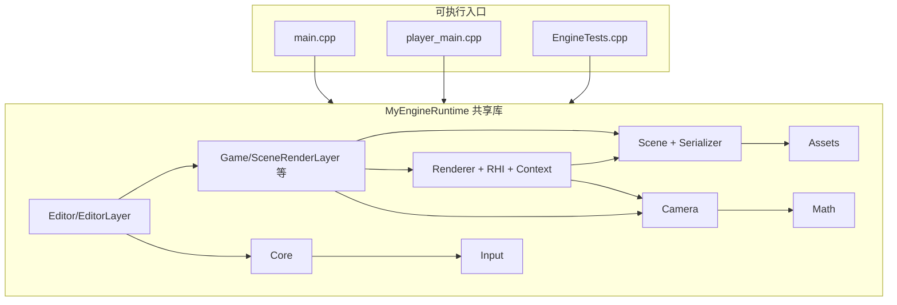

# MyEngine 架构说明

本文档描述当前仓库的 **目录结构**、**构建目标**、**源码模块划分** 以及 **模块间依赖关系**。若与实现不一致，以 `xmake.lua` 与源码为准。

---

## 1. 仓库与目录结构

```
MyEngine/
├── xmake.lua                 # 工程与目标定义
├── xmake/imgui_metal.lua     # macOS：ImGui + Metal 辅助目标（imgui_metal）
├── main.cpp                  # 编辑器入口：SDL3 + Application，推入 SceneRenderLayer 与 EditorLayer
├── player_main.cpp           # 运行时入口：仅 SceneRenderLayer（无编辑器 UI）
├── design.md                 # 本文档
├── Content/                  # 游戏内容（构建后复制到输出目录）
├── tests/
│   └── EngineTests.cpp       # 单元测试（序列化、Transform、Input、资源导入等）
├── thirdparty/
│   └── ImGuizmo/             # 场景视口 Gizmo（与 ImGui 配合）
└── src/
    ├── Runtime/
    │   ├── Core/             # Application、Engine、Window、Event、Layer、LayerStack、Time、Logger、Platform、EngineMath
    │   ├── Input/            # 输入快照（与 Engine 事件循环配合）
    │   ├── Math/             # Vector/Quaternion/Mat4/Color/Ray/AABB 等；Mat4Inverse 实现
    │   ├── Assets/           # AssetManager、导入器；Mesh/Material/Texture/Model 资产类型
    │   ├── Scene/            # Scene、Actor、Transform、组件、SceneSerializer（JSON）
    │   ├── Camera/           # 相机（透视/正交；与 SceneRenderLayer 中飞行/轨道逻辑配合）
    │   ├── Renderer/         # IRenderContext、Renderer、MainPass、ShadowPass、平台 Context 实现
    │   │   └── RHI/          # GpuBuffer、GpuTexture、GpuShader、SwapChain 等抽象
    │   ├── Game/             # SceneLayer、SceneRenderLayer、GameLayer、TriangleLayer（示例/遗留层）
    │   └── RuntimeModule.cpp # 仅占位，保证共享库至少有一个翻译单元
    └── Editor/
        └── EditorLayer.*     # ImGui：工具栏、Outliner、Scene View、Inspector、日志、资源浏览器等
```

---

## 2. 构建目标与第三方依赖

### 2.1 xmake 目标

| 目标 | 类型 | 说明 |
|------|------|------|
| `MyEngineRuntime` | `shared`（`runtime.dll`/`libruntime.so` 等） | 聚合 **Runtime** 全部 `.cpp`、**EditorLayer**、`ImGuizmo`；对外导出 `src/Runtime/**/*.h`（public include） |
| `MyEngineEditor` | `binary` | 链接 `MyEngineRuntime`，入口 `main.cpp`；规则 `copy_game_content` |
| `MyEnginePlayer` | `binary` | 链接 `MyEngineRuntime`，入口 `player_main.cpp`；同样复制 `Content` |
| `MyEngineTests` | `binary` | 链接 `MyEngineRuntime`，`tests/EngineTests.cpp`；运行时仍依赖 SDL（链接与 DLL 复制与编辑器类似） |

**说明**：编辑器 UI 并非独立静态库，而是 **编译进 `MyEngineRuntime` 共享库**；可执行文件只负责入口与 `PushLayer` 组合。`MyEnginePlayer` 虽不推入 `EditorLayer`，仍定义 `MYENGINE_ENABLE_IMGUI`（与 `xmake.lua` 一致），便于将来或工具链统一。

### 2.2 第三方包（`add_requires`）

| 包 | 用途 |
|----|------|
| **libsdl3** | 窗口、事件、文件对话框、时间；与 ImGui 的 SDL3 后端一致（需统一 shared，避免重复符号） |
| **imgui** | 编辑器 UI；Windows 配置含 `dx11`/`dx12` 后端；macOS 通过 `imgui_metal` 与 Metal 集成 |
| **nlohmann_json** | `SceneSerializer` 与测试 |
| **stb** | 图像加载等 |
| **tinyobjloader** | 模型导入（`AssetImporters`） |

平台相关：`Windows` 链入 `d3d11`、`d3d12`、`dxgi`、`d3dcompiler` 等；`macOS` 链入 `Metal`、`MetalKit` 等框架。

---

## 3. 源码模块分层与依赖关系

### 3.1 概念分层（依赖方向：上层可依赖下层，反之避免）

由下至上可概括为：

1. **Math** — 数学类型与少量实现（如 `Mat4Inverse`），**不依赖**引擎子系统。
2. **Core** — 应用生命周期、窗口抽象、事件、Layer 栈、时间管理、日志、平台宏。**仅通过 Window/事件路径触及 SDL**，被几乎所有上层使用。
3. **Input** — 输入状态；由 **Core/Engine** 的事件循环喂入，供 Layer 或编辑器查询。
4. **Assets** — 资源注册与加载；依赖文件系统与第三方导入库；**Mesh 等数据可被 Scene 组件引用**，导入路径可与 `SceneSerializer` 存储的路径字符串衔接。
5. **Scene** — `Scene` / `Actor` / `Transform` / `Component` / `MeshRendererComponent`；**序列化**依赖 **nlohmann_json**；组件内引用 **Assets**（网格/材质句柄或路径）。
6. **Camera** — 视图投影与控制器相关数学；依赖 **Math**，与 **Renderer** 的数据约定一致。
7. **Renderer（含 RHI）** — `IRenderContext` 及 D3D11/D3D12/Metal 实现；`Renderer` / `MainPass` / `ShadowPass` 消费 **Scene + Camera + RHI**；**不反向依赖** Editor。
8. **Game** — `SceneLayer` 持有 **Scene**，并提供 `LoadScene`/`SaveScene`（基于 **SceneSerializer**）；`SceneRenderLayer` 在 **SceneLayer** 之上组合 **IRenderContext + Renderer + Camera**。
9. **Editor** — `EditorLayer` 继承 **Layer**（非 `SceneLayer`），持有 **`SceneRenderLayer*`** 以编辑同一场景；依赖 **ImGui**、**ImGuizmo**、**Engine/Window** 与序列化接口。

### 3.2 依赖关系示意（Mermaid）



### 3.3 关键类型组合（编辑器 vs 玩家）

| 组合 | `IRenderContext` | 推入的 Layer | Present 行为 |
|------|------------------|-------------|--------------|
| **编辑器**（`main.cpp`） | `CreateD3D11Context` / `CreateD3D12Context` / `CreateMetalContext` | 先 `SceneRenderLayer`，后 `EditorLayer` | `SceneRenderLayer::SetPresentEnabled(false)`，由编辑器在 ImGui 之后统一 `EndFrame` |
| **玩家**（`player_main.cpp`） | 同上 | 仅 `SceneRenderLayer` | `SetPresentEnabled(true)`，场景层内 Present |

---

## 4. 运行时主循环（Core）

```
Application::Run()
  └─ Engine::RunLoop()
       ├─ PollPlatformEvents()  → SDL 事件 → Input + 内部事件队列
       ├─ DispatchEvents()       → Layer::OnEvent
       ├─ UpdateLayers()         → Layer::OnUpdate
       └─ RenderLayers()         → Layer::OnRender（顺序与 PushLayer 顺序一致）
```

---

## 5. 渲染后端与平台

- **Windows**：`D3D11Context` / `D3D12Context`；入口可通过 `--backend d3d11 | d3d12` 选择。
- **macOS**：`MetalContext`；ImGui 与 Metal 通过 `xmake/imgui_metal.lua` 辅助目标衔接。
- **Linux**：当前仅有 `MYENGINE_PLATFORM_LINUX` 等编译定义；**无 GPU `IRenderContext` 实现**，需后续补充（如 Vulkan/OpenGL）。

---

## 6. 资源与场景数据流

- **AssetManager**：按扩展名加载纹理/模型；内置白/黑/法线贴图、立方体等；`GetByPath` / `Load` / `Register`。
- **SceneSerializer**：场景 JSON 序列化；`MeshRendererComponent` 持久化 mesh/material **路径**，加载时通过 **AssetManager** 解析。
- **构建产物**：`copy_game_content` 将仓库根目录 **Content** 复制到目标输出目录，便于相对路径资源与测试。

---

## 7. 数学约定

- **行主序** `Mat4`，**左手坐标系**，**Y 向上**，与 D3D 深度 0..1 及 HLSL `mul(vector, matrix)` 风格一致（见 `Core/EngineMath.h`）。
- **Quaternion** `Math::Quat`（`x,y,z,w`）：与上述 `Mat4` 行向量约定一致；`Quat::ToMat4` / `Quat::FromMat4` 在 `EngineMath.h` 中实现，与 `Transform`/`Mat4::Rotation` 同一套旋转语义。

---

## 8. 文档维护说明

早期文档若以 `TriangleLayer` 或多静态库为主线，当前主线为 **`SceneRenderLayer` + `Renderer` + `EditorLayer`**，并以 **`MyEnginePlayer`** 作为无编辑器运行时。后续增删目录或目标时，请同步更新本节与 `xmake.lua`。
