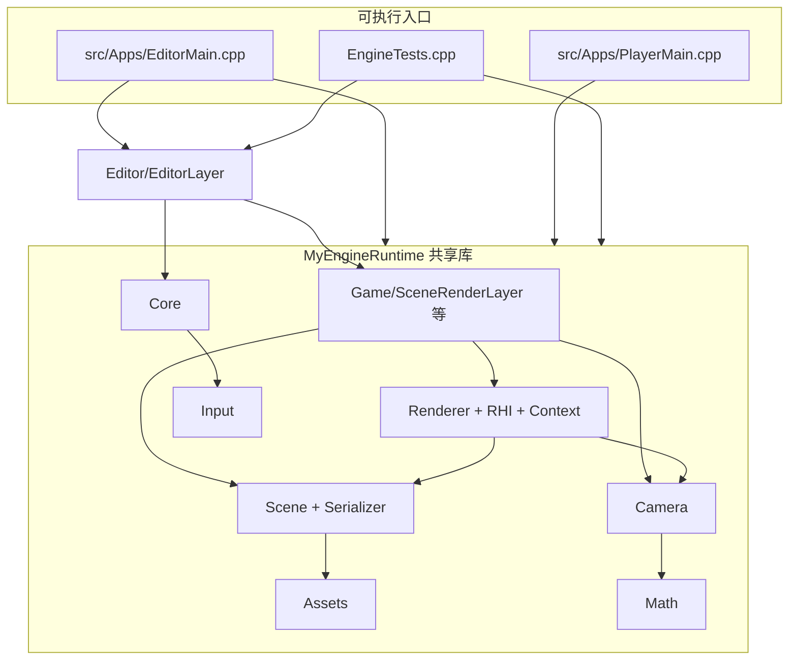
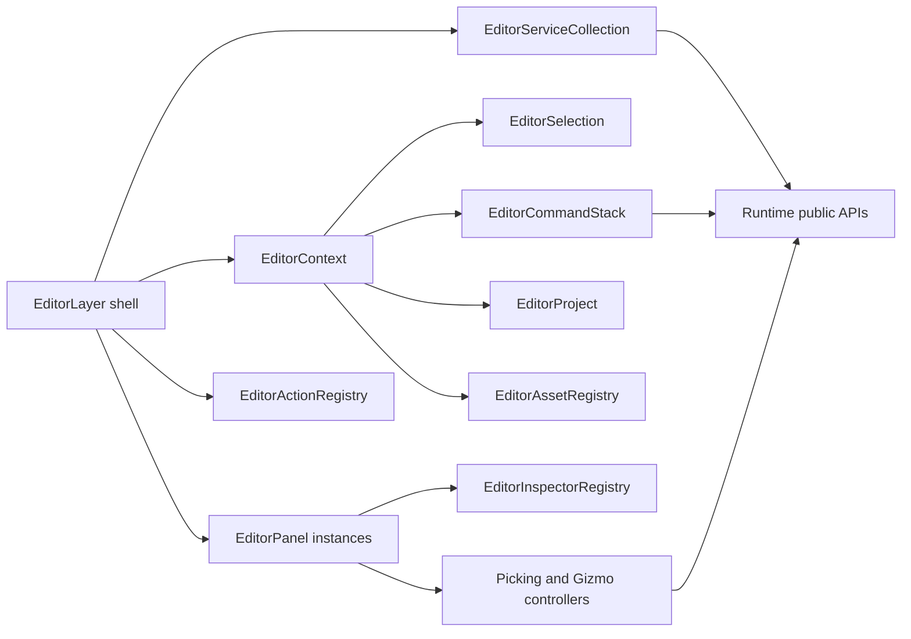
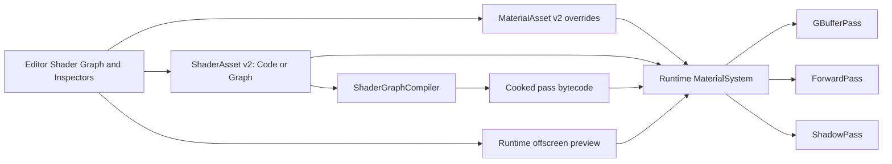
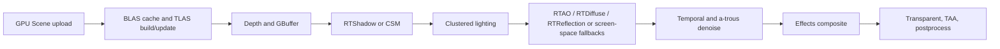

# MyEngine 架构说明

本文档描述当前仓库的 **目录结构**、**构建目标**、**源码模块划分** 以及 **模块间依赖关系**。若与实现不一致，以 `xmake.lua` 与源码为准。

---

## 1. 仓库与目录结构

```
MyEngine/
├── xmake.lua                 # 工程与目标定义
├── xmake/imgui_metal.lua     # macOS：ImGui + Metal 辅助目标（imgui_metal）
├── design.md                 # 本文档
├── Content/                  # 游戏内容（构建后复制到输出目录）
├── tests/
│   └── EngineTests.cpp       # 单元测试（序列化、Transform、Input、资源导入等）
├── thirdparty/
│   └── ImGuizmo/             # 场景视口 Gizmo（与 ImGui 配合）
└── src/
    ├── Apps/                 # Editor/Player/Cooker/IconTool/Packager 可执行入口
    ├── Runtime/
    │   ├── Core/             # Application、Engine、Window、Event、Layer、LayerStack、Time、Logger、Platform、EngineMath
    │   ├── Input/            # 输入快照（与 Engine 事件循环配合）
    │   ├── Audio/            # miniaudio 后端、音频资源、AudioSource 组件
    │   ├── Math/             # Vector/Quaternion/Mat4/Color/Ray/AABB 等；Mat4Inverse 实现
    │   ├── Assets/           # AssetManager、导入器；Mesh/Material/Texture/Model 资产类型
    │   ├── Scene/            # Scene、Actor、Transform、组件、SceneSerializer（JSON）
    │   ├── Camera/           # 相机（透视/正交；与 SceneRenderLayer 中飞行/轨道逻辑配合）
    │   ├── Renderer/         # IRenderContext、Renderer、MainPass、ShadowPass、平台 Context 实现
    │   │   └── RHI/          # GpuBuffer、GpuTexture、GpuShader、SwapChain 等抽象
    │   ├── Game/             # SceneLayer、SceneRenderLayer、GameLayer、TriangleLayer（示例/遗留层）
    │   └── RuntimeModule.cpp # 仅占位，保证共享库至少有一个翻译单元
    └── Editor/
        └── EditorLayer.*     # ImGui：工具栏、Outliner、Scene View、Inspector、日志、资源浏览器等
```

---

## 2. 构建目标与第三方依赖

### 2.1 xmake 目标

| 目标 | 类型 | 说明 |
|------|------|------|
| `MyEngineRuntime` | `shared`（`runtime.dll`/`libruntime.so` 等） | 聚合 **Runtime** 全部 `.cpp`；对外导出 `src/Runtime/**/*.h`（public include） |
| `MyEngineEditor` | `binary` | 链接 `MyEngineRuntime`，入口 `src/Apps/EditorMain.cpp`，并编译 `xmake.lua` 中共享的 `editor_sources` 与 `ImGuizmo`；规则 `copy_game_content` |
| `MyEnginePlayer` | `binary` | 链接 `MyEngineRuntime`，入口 `src/Apps/PlayerMain.cpp`；同样复制 `Content` |
| `MyEngineTests` | `binary` | 链接 `MyEngineRuntime`，编译 `tests/*.cpp` 与共享 `editor_sources`；运行时仍依赖 SDL（链接与 DLL 复制与编辑器类似） |

**说明**：编辑器 UI 不编译进 `MyEngineRuntime` 共享库；`MyEngineEditor` 与 `MyEngineTests` 通过 `xmake.lua` 的共享 `editor_sources` 列表复用同一批 Editor 源文件。`MyEnginePlayer` 不编译 Editor 源文件，保持 runtime-only。

### 2.2 第三方包（`add_requires`）

| 包 | 用途 |
|----|------|
| **libsdl3** | 窗口、事件、文件对话框、时间；与 ImGui 的 SDL3 后端一致（需统一 shared，避免重复符号） |
| **imgui** | 编辑器 UI；Windows 配置含 `dx11`/`dx12` 后端；macOS 通过 `imgui_metal` 与 Metal 集成 |
| **nlohmann_json** | `SceneSerializer` 与测试 |
| **stb** | 图像加载等 |
| **tinyobjloader** | 模型导入（`AssetImporters`） |
| **miniaudio** | 运行时音频设备、解码和播放 |
| **Slang / slangc** | 统一 Shader 编译入口；`.shader + .hlsl/.hlsli` 一次编写，cook/热编译生成 D3D11、D3D12、Metal 后端产物 |

平台相关：`Windows` 链入 `d3d11`、`d3d12`、`dxgi`、`d3dcompiler` 等；`macOS` 链入 `Metal`、`MetalKit` 等框架。

---

## 3. 源码模块分层与依赖关系

### 3.1 概念分层（依赖方向：上层可依赖下层，反之避免）

由下至上可概括为：

1. **Math** — 数学类型与少量实现（如 `Mat4Inverse`），**不依赖**引擎子系统。
2. **Core** — 应用生命周期、窗口抽象、事件、Layer 栈、时间管理、日志、平台宏。**仅通过 Window/事件路径触及 SDL**，被几乎所有上层使用。
3. **Input** — 输入状态与项目可配置 gameplay 映射；由 **Core/Engine** 的事件循环喂入 raw 键鼠/手柄快照，上层可直接查询 raw input，也可通过项目 `Content/Config/Input.input.json` 定义的 `Button` / `Axis1D` / `Axis2D` action 查询语义化输入名。
4. **Audio** — `AudioEngine` 封装 miniaudio 设备生命周期，`AudioClipAsset` 走统一资源系统，`AudioSourceComponent` 通过场景组件生命周期播放和停止声音；设备不可用时进入无声模式。Master 及 Music/Effects/Voice/UI 总线统一处理用户音量、静音和游戏暂停策略；AudioSource 可选择流式解码、淡变、优先级与并发组，运行时诊断公开 voice 数量和确定性抢占统计。
5. **Assets** — 资源注册与加载；依赖文件系统与第三方导入库；**Mesh/AudioClip 等数据可被 Scene 组件引用**，导入路径可与 `SceneSerializer` 存储的路径字符串衔接。
6. **Scene** — `Scene` / `Actor` / `Transform` / `Component` / `MeshRendererComponent` / `AudioSourceComponent`；**序列化**依赖 **nlohmann_json**；组件内引用 **Assets**（网格/材质/音频句柄或路径）。
7. **Gameplay / Navigation** — 动画状态机、角色控制、Combat/Interaction、CPU billboard 粒子、AudioListener、反馈服务、网格 NavMesh/A*、NavAgent、Enemy FSM 和 `SceneManager` 全部属于 Runtime；Editor 仅提供 Inspector、NavMesh 烘焙与诊断。
7. **Camera** — 视图投影、`CameraComponent` 与 viewport 控制器相关数学；依赖 **Math**，与 **Renderer** 的数据约定一致。
8. **Renderer（含 RHI）** — `IRenderContext` 及 D3D11/D3D12/Metal 实现；`Renderer` / `MainPass` / `ShadowPass` 消费 **Scene + Camera + RHI**；**不反向依赖** Editor。
9. **Game** — `SceneLayer` 持有分离的 **EditorWorld/PlayWorld**：Load/Save/Undo 等编辑入口只操作 EditorWorld，`BeginPlay()` 通过 **SceneSerializer** 克隆出临时 PlayWorld，运行时模拟只更新 PlayWorld；`SceneRenderLayer` 在 **SceneLayer** 之上组合 **IRenderContext + Renderer + SceneViewport/GameViewport**，Player 使用 simulation scene 与主 `CameraComponent`，Editor 同时输出 Scene/Game 两个 viewport。
10. **Editor** — `EditorLayer` 继承 **Layer**（非 `SceneLayer`），持有 **`SceneRenderLayer*`** 以编辑同一场景；依赖 **ImGui**、**ImGuizmo**、**Engine/Window** 与序列化接口。

Runtime 组件类型统一登记到 `TypeRegistry`。注册描述器提供稳定类型/属性 ID、工厂、schema version、默认值、序列化、Inspector hints、脚本访问标记和 Prefab override 路径；`ComponentRegistry` 是兼容 facade。Camera、Light 与 BoxCollider 已使用宏构建的属性描述器，其他组件继续走原有虚函数序列化并可渐进迁移。

每个 `Scene` 持有 `WorldFrameScheduler`，按 `WorldFrameBegin → PreUpdate → FixedPrePhysics → FixedPhysics → FixedPostPhysics → Update → LateUpdate → RenderExtract → WorldFrameEnd` 驱动 PlayWorld。固定步长 accumulator 属于 Scheduler，默认 60 Hz、每帧最多追赶 4 tick；`PhysicsWorld::StepFixed` 只执行单次物理模拟。应用级事件、Layer、Editor UI、渲染提交与 Present 仍由 `Engine`/Layer 路径拥有。

### 3.2 依赖关系示意（Mermaid）



### 3.3 关键类型组合（编辑器 vs 玩家）

| 组合 | `IRenderContext` | 推入的 Layer | Present 行为 |
|------|------------------|-------------|--------------|
| **编辑器**（`src/Apps/EditorMain.cpp`） | `CreateD3D11Context` / `CreateD3D12Context` / `CreateMetalContext` | 先 `SceneRenderLayer`，后 `EditorLayer` | `SceneRenderLayer::SetPresentEnabled(false)`，由编辑器在 ImGui 之后统一 `EndFrame` |
| **玩家**（`src/Apps/PlayerMain.cpp`） | 同上 | 仅 `SceneRenderLayer` | `SetPresentEnabled(true)`，场景层内 Present |

---

## 4. 运行时主循环（Core）

```
Application::Run()
  └─ Engine::RunLoop()
       ├─ PollPlatformEvents()  → SDL 事件 → Input + 内部事件队列
       ├─ DispatchEvents()       → Layer::OnEvent
       ├─ UpdateLayers()         → Layer::OnUpdate
       └─ RenderLayers()         → Layer::OnRender（顺序与 PushLayer 顺序一致）
```

---

## 5. 渲染后端与平台

- **Windows**：`D3D11Context` / `D3D12Context`；入口可通过 `--backend d3d11 | d3d12` 选择。
- **macOS**：`MetalContext`；ImGui 与 Metal 通过 `xmake/imgui_metal.lua` 辅助目标衔接。
- **Linux**：当前仅有 `MYENGINE_PLATFORM_LINUX` 等编译定义；**无 GPU `IRenderContext` 实现**，需后续补充（如 Vulkan/OpenGL）。

Shader 管线以 HLSL 为唯一源码形态：`.shader` 描述逻辑 stage、entry 与
defines，源码仍放在 `EngineContent/Shaders` 或项目 `Content/Shaders` 下的
`.hlsl/.hlsli`。`ShaderCompilerSlang` 负责将同一份 HLSL 编译为当前 RHI 所需
产物：D3D11/D3D12 使用 DX bytecode，Metal 使用 MSL 文本 blob；cooked shader
容器 v5 保存后端字节码、反射与 ABI 元数据，并兼容读取旧容器。Editor 与未挂载
`Content.pak` 的开发态 Player 通过 `ShaderCacheService` 使用项目级
`Library/windows-x64/ShaderCache/<cacheKey>.shader` 内容寻址缓存；键包含构建与
cooker ABI、编译器版本、目标后端/平台、设置以及 `.shader/.hlsl/.hlsli` 完整依赖
内容。发布包 Player 切换到 `RuntimeCookedOnly`、移除开发态 resolver，只消费
`Content.pak` 中的 cooked shader，缺失或不匹配时明确失败而不在用户机器上编译。

`Renderer` 按实际 render path、device profile 与能力收集精确的启动 Shader 集，
`ShaderManager` 将规范化去重后的缓存解析与缺失项 cook 作为有界并行后台批次执行；
后台阶段不创建 GPU 对象。批次未完成时渲染线程提交有效清屏帧，Editor 仍按既有
frame ownership 在 ImGui 后统一 Present；批次完成后才由渲染线程消费产物并创建
resident shader/PSO。缓存 miss 先写入跨进程唯一 staging 路径，cook 后重新计算完整
依赖键并校验 source/pass/backend/ABI；只有前后键稳定时才通过事务写原子发布到最终
内容地址，源码在编译期间变化则重试，`allowCompile=false` 永不修复或覆盖无效缓存。

驱动级管线缓存独立于 cooked shader 缓存并放在 `%LOCALAPPDATA%/MyEngine/PipelineCache`。
D3D12 以 adapter/driver 身份隔离目录，以共享 compute root-signature ABI、DXIL 与长度
标识持久化 compute PSO blob；驱动拒绝旧 blob 时用权威 DXIL 重建并原子替换，graphics
PSO 当前仍按需创建。Vulkan 以 vendor/device/driver 与 `pipelineCacheUUID` 隔离
`VkPipelineCache`，同时参与 graphics/compute pipeline 创建，并在设备关闭时原子保存；
损坏或供应商判定无效的缓存会回退为空缓存而不阻止设备启动。
开发机需要在 `PATH` 中提供 `slangc`，或通过 `MYENGINE_SLANGC` 指定编译器路径；
Windows 热编译在 Slang 不可用时可临时回退到原 D3D 编译器，Metal 后端必须依赖 Slang。

---

## 6. 资源与场景数据流

Scene 切换使用分阶段 load plan：工作线程只读取、解析 JSON 并收集依赖；
Actor/Component 构造、组件反序列化、Prefab 展开与 GPU 工作仍在各自所属线程，
并按帧预算推进。新 Scene 完成后才原子替换旧 Scene；失败或取消不会破坏旧世界。
Asset 缓存按未引用、未 pin 的 LRU 候选和 CPU 高低水位回收，普通 Scene 切换不再清空全局缓存。

- **AssetManager**：按扩展名加载纹理/模型；内置白/黑/法线贴图、立方体等；`GetByPath` / `Load` / `Register`。
- **SceneSerializer**：场景 JSON 序列化；`MeshRendererComponent` 持久化 mesh/material **路径**，加载时通过 **AssetManager** 解析。Prefab 实例只保存源资源引用、UUID、根放置和覆盖数据，实例子树由 `PrefabSystem` 批量重建；格式与限制见 [`docs/classes/scene/PrefabSystem.md`](docs/classes/scene/PrefabSystem.md)。
- **Input action map**：`ProjectConfig` 默认引用 `Content/Config/Input.input.json`；Editor 打开项目和 Player 启动时加载该 JSON，失败或缺失时回退到内置默认映射。Lua 脚本通过 `Input.action_down("Jump")`、`Input.axis2("Move")` 等接口读取语义化输入。
- Runtime keeps the loaded project action map as an immutable reset baseline.
  User-settings schema v2 may layer a validated action-map override over that
  baseline; conflict discovery and rebinding mutate only the runtime copy.
  Input activity selects keyboard/mouse or gamepad glyph mode, while live user
  preferences control mouse/gamepad sensitivity, Y inversion, gamepad dead
  zone, and vibration strength. AngelScript can inspect conflicts, rebind,
  persist, or reset bindings without writing project content.
- **构建产物**：`copy_game_content` 将仓库根目录 **Content** 复制到目标输出目录，便于相对路径资源与测试。

---

## 7. 数学约定

- **行主序** `Mat4`，**左手坐标系**，**Y 向上**，与 D3D 深度 0..1 及 HLSL `mul(vector, matrix)` 风格一致（见 `Core/EngineMath.h`）。
- **Quaternion** `Math::Quat`（`x,y,z,w`）：与上述 `Mat4` 行向量约定一致；`Quat::ToMat4` / `Quat::FromMat4` 在 `EngineMath.h` 中实现，与 `Transform`/`Mat4::Rotation` 同一套旋转语义。

---

## 8. 文档维护说明

早期文档若以 `TriangleLayer` 或多静态库为主线，当前主线为 **`SceneRenderLayer` + `Renderer` + `EditorLayer`**，并以 **`MyEnginePlayer`** 作为无编辑器运行时。`SceneRenderLayer` 现在是薄 facade：`SceneViewport` 管理编辑器自由飞行相机、输入和 picking ray，默认渲染 EditorWorld，也可由 Editor-only 的 `EditorWorldViewMode::PlayWorldInspect` 切到 PlayWorld 只读检查；`GameViewport` 解析当前 simulation scene 的主 `CameraComponent`，编辑态预览 EditorWorld，Play/Pause/Step 时渲染 PlayWorld；每个 viewport 各自持有 `ViewportRenderExecution`，从而拥有独立 Renderer/offscreen scene color。`DefaultSceneFactory` 仅保留为空实现的 legacy hook，不再隐式创建 demo actor。后续增删目录或目标时，请同步更新本节与 `xmake.lua`。

---

## Runtime icon service

`src/Runtime/Miscs/IconsManager` is the shared SVG icon service for the engine. It resolves SVG files from `EngineContent/Editor/Icons`, rasterizes them to RGBA8 pixels, uploads cached icon textures through `IRHIDevice`, applies SDL window icons, and writes multi-size Windows `.ico` resources for Editor, Player, and Cooker. Editor UI consumes the service through `src/Editor/UI/EditorWidgets`; Runtime and Player do not depend on Editor headers.

## Runtime performance budgets

`src/Runtime/Core/RuntimePerformanceBudget` is the backend-neutral policy and
reporting boundary for production performance gates. Callers feed frame, GPU,
working-set, and dropped-fixed-tick samples after choosing an explicit warmup
window. Evaluation produces deterministic percentile/resource violations and a
JSON summary. Platform process sampling, Player capture lifecycle, hardware
identity, and checked-in profile selection remain outside this policy class so
the same evaluator can be used by Player, tests, and future lab tooling.
Player enables capture with `--performance-report <json>` and samples real
`FrameStats`, scheduler dropped ticks, available GPU timings, and process
working set. Reports include raw post-warmup samples and build/scene/backend/
resolution provenance and are committed through `TransactionalFileWriter`.
`IRHIContext::GetDeviceIdentity` supplies backend-neutral adapter/driver identity.
Project-owned budgets live in versioned
`Content/Config/Performance.profile.json`; Player loads that profile from the
mounted runtime file system and applies only explicit CLI overrides.

`RuntimeResourceBudgetController` is the Player-side resource pressure
coordinator. It applies CPU asset high/low watermarks and bounded deterministic
LRU eviction, observes queued GPU-upload task/byte pressure, and publishes the
global Actor cap consumed by additive WorldZone instantiation. Asset eviction
reports distinguish pin, builtin, and external-reference blockers; upload
statistics distinguish task, byte, and time-budget deferrals. The latest values
flow through `FrameStatsProvider`, Player performance JSON, and the Runtime
`Resources::GetStatsJson()` script facade. GPU residency, descriptor occupancy,
and RenderGraph transient allocation are also routed through this facade.
`RHIResourceStatsProvider` accounts actual live Buffer/Texture estimates at the
four backend creation paths and releases them from the common GPU object
destructor; views, samplers, and bind groups provide a backend-neutral logical
Descriptor count. D3D12 additionally accounts native resource, sampler, RTV,
and DSV heap slots from allocation until the deferred GPU-fence release actually
returns each lease; reserved slots, peaks, and heap exhaustion are observable.
RenderGraph rejects over-budget live transient sets before calling the RHI and
bounds its descriptor-keyed cross-frame pool with stable low-watermark trimming.
`MaterialResourceCache` registers texture residency in a global stable LRU:
unpinned cache-owned textures can be released to the GPU low watermark, while
active views and pinned assets produce explicit blockers. Eviction clears the
asset's raw GPU handle and the normal material path rebuilds it on demand.
Mesh vertex/index buffers are tracked independently with an active-use grace
window, then invalidated and rebuilt through the same material upload path when
cold. `RuntimeQualityDegradation` is the backend-neutral fallback when pressure
persists after eviction: the resource controller raises or restores a bounded
level using separate pressure/healthy hysteresis, texture uploads apply a mip
bias, and particle counts are reduced without changing authored settings.

## Runtime task ownership

`src/Runtime/Core/TaskService` owns bounded background workers and deterministic
priority/FIFO queues. `TaskHandle<T>` propagates results, cancellation, and
exceptions; `TaskScope` is the lifetime boundary that cancels and joins all
registered work. SceneManager scene read/parse preparation uses a scope-owned
high-priority task. AssetManager asynchronous loads use a manager-owned scope;
deduplicated requests publish their handle before worker completion can remove
the in-flight entry, and `Clear` cancels/joins work before locking the cache.
SceneManager preload handles observe those shared requests without taking over
their cancellation ownership. Runtime object construction, component
deserialization, GPU uploads, and scene activation remain on their existing
owning threads. ProjectPublisher shader cooking uses per-publish low-priority
task scopes, so every early return cancels and joins outstanding compiler work.
Scene transitions expose separate read, parse/dependency discovery, preload,
budgeted main-thread instantiation, GPU-fence wait, and atomic activation stages.
The upload fence is monotonic and captures a queue boundary rather than waiting
for global queue emptiness, keeping unrelated later uploads out of the scene
transition's ownership boundary.
Successful activation transfers the request's dependency pins into the new
`Scene`; failed, cancelled, superseded, and destructed requests release their
pins without transfer. Each Scene also exposes a generation-backed weak
`SceneLifetimeToken`. Async completions must acquire and retain its shared
lifetime guard while committing World state. Scene destruction takes the
exclusive gate, invalidates the token, and only then releases components and
owned asset pins, eliminating check-then-use teardown races.
Scenes also own stable-name `WorldZone` scopes for additive/procedural chunks.
A zone groups Actor handles, dependency pins, a cancellable `TaskScope`, and its
own generation token. Zone teardown invalidates the token, cancels and joins
work, destroys owned Actors, and releases pins before erasing the scope. Queued
AngelScript and UI callbacks retain Scene lifetime tokens and acquire guards
before invoking runtime objects, so global event queues cannot commit into a
destroyed replacement World.
`WorldZoneStreamer`, scheduled in `PreUpdate`, builds on that scope for
project-authored additive scene fragments. Distance bounds and portal state feed
load/unload hysteresis; priority, stable name, actor budget, and transition
budget make high-speed teleports deterministic. Read/parse work belongs to the
zone task scope, dependencies are pinned before incremental instantiation, and
any invalid local relationship rolls the entire generation back. Cross-zone
parent references are intentionally forbidden.
`SceneRenderLayer` maps those stages to an engine-owned RmlUi system overlay,
independent of project canvases. Loading shows monotonic progress and supports
cancel; failure preserves the current safe World and exposes retry/dismiss
controls. Player creates and begins that safe World first, then requests its
startup scene through SceneManager, so a missing or malformed startup scene is
recoverable after graphics/UI initialization instead of aborting startup.

`SaveGame` schema v3 adds player-facing slot metadata, build/timestamp
provenance, sorted slot discovery, and explicit last-known-good recovery. The
Runtime API accepts a storage-root override; Player binds it to SDL's
per-project user preference directory so published installs never require write
access to their package directory.

## Runtime game flow

`GameFlowController` is the Runtime authority for Boot, MainMenu, Loading,
Gameplay, Paused, and GameOver state. Pause requests are reason-owned so user,
editor, system-modal, and window-inactive owners cannot resume one another.
Its snapshot defines world/UI/system input ownership, simulation pause, audio
pause, and modal behavior. `SceneLayer`, scene-loading transitions, gameplay
action queries, and AngelScript `Game.Pause/Resume` consume the same contract.
Player also maps SDL focus changes to the versioned `pauseWhenUnfocused`
preference and the independent `WindowInactive` pause reason; Editor defaults
to leaving this policy disabled.

## Runtime UI / RmlUi

`src/Runtime/UI` integrates RmlUi through the local xmake package
`myengine-rmlui` for in-game retained-mode UI. `UICanvasComponent` is the
serialized scene entry point and supports two authoring sources: `AssetDocument`
loads project-relative RML, RCSS, and font paths, while `ActorTree` treats the
Scene Actor subtree as the editable UI hierarchy and generates an in-memory RML
document. `UIRectTransformComponent`, widget components, and layout components
are Runtime serialization/editor facades; RmlUi remains the DOM/layout/render
backend. `UISystem` owns RmlUi initialization, context update, input forwarding,
font loading, actor-tree document reload, and draw-list collection.

`RuntimeUIScreenStack` owns stable MainMenu/Pause/Settings/GameOver screen and
action IDs independently from Rml DOM lifetime. Stack entries retain their
focused action across nested modal screens; SceneRenderLayer routes keyboard,
gamepad, and pointer actions to GameFlow, while UISystem renders the current
view. The standard Settings screen applies and transactionally persists mixer
values; projects may replace the visual layer without replacing ownership.

`UISystem` owns runtime display adaptation rather than storing it in RML
documents: user UI scale drives the Rml density-independent pixel ratio,
normalized safe-area insets constrain engine-standard overlays/screens, and a
deterministic narrow-layout threshold handles small or tall viewports. Engine
fallback font faces and layout/font diagnostics make missing packaged fonts or
invalid safe regions observable. Player startup, the standard Settings screen,
and `UserSettings` script writes feed the same live accessibility state.
The same state drives a bounded stable-ID subtitle queue rendered inside the
safe area and attenuates `GameplayFeedbackComponent` camera shake. Subtitle
priority, preemption/resume, expiry, and overflow are deterministic and exposed
through the Runtime script facade without exposing Rml objects.
Project-authored flow-screen visuals are loaded from the optional versioned
`Content/Config/RuntimeScreens.ui.json`. Overrides may change documents, titles,
and labels, while `RuntimeUIScreenStack` retains stable actions, modal policy,
focus stack, and GameFlow ownership. UISystem validates the required Rml element
contract at activation and atomically uses the generated standard document when
the project document is absent or invalid.
Input prompts resolve through the versioned project glyph atlas. Input owns
last-active-device selection and SDL gamepad-family classification; the atlas
owns stable source-to-sprite/localized-label data. Runtime UI and scripts query
resolved descriptors and never branch directly on vendor-specific button names.

Rendering stays inside the existing Runtime renderer boundary: RmlUi emits
geometry through `RmlRenderInterface`, which uploads RHI buffers/textures and
records `UIDrawList` commands. `Renderer` appends `ScreenUIPass` at the end of
the RenderGraph, after scene composite, and draws the UI into the backbuffer or
offscreen viewport target. Editor remains ImGui-based and only exposes runtime
UI assets/components for authoring through Scene Outliner creation menus and
Inspector sections.

## 9. Project startup flow

- `ProjectConfig` is a Runtime service shared by Editor and Player. It reads
  `MyEngine.project.json` from the project root.
- `RuntimeUserSettingsStore` owns the versioned per-user display, graphics,
  audio, input, and accessibility document. Player places it below SDL's
  per-project preference directory, recovers from a last-known-good backup,
  and resolves startup values as project defaults < user settings < command
  line. Runtime scripts can read, replace, or reset the document without
  depending on Editor UI.
- `startupScene` is stored as a project-relative path under `Content/`.
- Editor can assign the current saved scene as the startup scene. Player loads
  it before entering Play mode; `--project` selects a root and `--scene`
  overrides the configured scene.
- Serialized project-owned asset references are written as project-relative
  paths. Legacy absolute paths remain readable.
- Editor startup is gated by `EditorWorkspace`: `--project` opens directly;
  otherwise the project selector provides recent/open/create flows.
- `ProjectPublisher` and `MyEngineCooker` create transactional Windows x64
  standalone builds: the previous successful output is retained until a staged
  package is complete, and is restored if installation fails.
- `ProjectValidator` is the shared Editor/Publisher readiness gate. It composes
  the cook dependency graph with project-local startup-scene verification,
  runtime AngelScript compilation, oversized-file warnings, and stable
  error/warning locations; only errors block publishing.
- Runtime `CookManifest` is the shared package contract. `CookedProjectCache`
  verifies the manifest and archive, serializes concurrent extraction by archive
  hash, atomically installs the cache, and rebuilds missing or damaged files
  before Player loads `startupScene`.
- Editor **Settings** owns project metadata, gameplay input config routing, and
  per-user editor shortcuts. Publish is allowed only from Edit mode with a
  saved, clean current scene.

---

## 10. Editor 架构

> Actor runtime lifecycle, generation-checked handles, batch construction, and
> safe-point structural mutation are documented in
> [`docs/classes/scene/ActorLifecycle.md`](docs/classes/scene/ActorLifecycle.md).

`EditorLayer` 只负责 ImGui 生命周期、顶层对象装配、panel 调度和文件对话框结果转发。Editor 业务按以下边界拆分：



- Editor actions are the single command surface for toolbar buttons and user
  shortcuts. `EditorShortcutMap` stores per-user chords in `EditorWorkspace`
  (`workspace.json`), detects chord conflicts, and dispatches only enabled
  `EditorActionRegistry` actions. These shortcuts are separate from project
  gameplay input maps under `Content/Config`.

- **Context**：统一暴露 scene layer、render context、window、engine、selection、command stack、project、asset registry、actions 和 typed services。选择状态只保存 `ActorID` 或资产路径。
- **Services**：`EditorLogService`、`EditorDialogService`、`EditorImportService`、`EditorShaderWatchService` 由 `EditorServiceCollection` 按注册顺序 attach/update，并按逆序 detach。
- **Panels**：Toolbar、Scene Hierarchy、Scene View、Game View、Inspector、Asset Browser、Log 都继承 `EditorPanel`。默认布局由 `EditorLayoutManager` 从 `Config/EditorLayout.default.json` 构建 ImGui DockSpace；用户调整后的 dock/float/window 状态保存到 editor state，不写入 scene。
- **Inspector**：组件 UI 实现为独立 `EditorInspectorSection`，由 `EditorInspectorRegistry` 按 order 稳定排序。连续属性拖动通过 scene transaction 合并为一次撤销记录。
- **Actions and commands**：按钮通过 `EditorActionRegistry` 调度；会修改场景的操作进入 `EditorCommandStack`。事务按执行顺序 redo、逆序 undo，新命令会清空 redo。
- **Viewport controllers**：Scene View 使用 `SceneViewport` 的 EditorCamera 进行自由飞行、screen ray/AABB picking 和 ImGuizmo；Scene View overlay 承载 EditorWorld/PlayWorldInspect 单按钮切换、transform 工具选择、3D axis gizmo 固定方向 framing、绕当前 focus 拖拽旋转和透视/正交切换；Game View 使用主 `CameraComponent` 预览运行时相机，不处理编辑 picking/gizmo。父子局部矩阵遵守行向量关系 `world = local * parentWorld`，因此 `local = world * inverse(parentWorld)`。
- **Dependency rule**：依赖方向只能是 `Editor -> Game/Scene/Assets/Renderer public APIs`。Runtime、Renderer 和 RHI 不允许反向包含 Editor 头文件。
**Editor UI foundation**: `EditorUIScaleManager` owns platform DPI and user UI
scale; `EditorFontManager` owns ImGui font-atlas rebuilds and role fonts
(`Inter` for UI, `JetBrains Mono` for logs, `Font Awesome` for icons);
`EditorThemeManager` applies centralized
color, rounding, and spacing tokens; `EditorWidgets` provides shared toolbar,
section, property-row, icon-button, and inline-message wrappers. UI scale and
theme are per-user `EditorWorkspace` preferences and never dirty scenes or
project runtime resources.
Editor design-system code lives under `src/Editor/UI`: scale and font managers,
theme/style tokens, text/icon tokens, widgets, property grids, notifications,
and the fixed status bar. The main menubar and status bar are viewport-fixed
editor chrome, not dock panels; `EditorLayoutManager` reserves their height
before building the DockSpace. The top `Toolbar` remains a dock panel and is
limited to play controls.

The Editor dock root uses an ImGui ID that is independent of the host window's
ID stack. When loading state written by an older ImGui build,
`EditorLayoutManager` adopts that file's usable root ID so the persisted split
tree is attached to the current host and resizes with it. An empty root using a
legacy scoped ID is treated as orphaned state even if a previous save already
stripped the detached windows' `DockId` fields; it is replaced with the project
default layout instead of leaving fixed `Pos/Size` panels at the top-left. An
empty root using the stable ID remains valid so an intentionally all-floating
layout still round-trips.

Editor UI pins Dear ImGui `v1.92.7-docking` with imnodes `v0.5`; the repository
package override carries only the small ImGui 1.92 draw-command/offset
compatibility patch needed by imnodes. The imnodes requirement includes a
MyEngine compatibility stamp in its package identity and the patch rejects any
ImGui version other than 1.92.7, preventing xmake from reusing a global-cache
binary compiled against the old ImGui draw-list ABI. On Windows the Editor executable is
`PerMonitorV2` DPI-aware and its SDL main window requests
`SDL_WINDOW_HIGH_PIXEL_DENSITY`. SDL global mouse coordinates, native window
coordinates, and ImGui monitor rectangles therefore share one desktop coordinate
contract, while each platform viewport reports its own framebuffer scale for
rendering. Main-window resize events preserve both coordinate-space dimensions:
`width/height` drive ImGui layout and input bounds, while
`pixelWidth/pixelHeight` drive the swapchain, GPU viewport, and runtime UI render
target. RHI backends initialize and resize swapchains only from drawable pixels;
this prevents a high-DPI resize from clipping the resized DockSpace to the old
top-left backbuffer rectangle. ImGui's SDL3 backend owns secondary-window flags and must never copy
the main window's fullscreen/maximized state. Undocking preserves the current
dock-node rectangle; panels do not force a floating size. Platform-window submission
filters SDL hidden, minimized, and occluded secondary windows before invoking renderer
callbacks. A dormant floating panel therefore retains its last contents and window state
without entering the D3D12 frame-latency wait path. `EditorUIScaleManager`
remains the only font/style scale owner, so experimental automatic ImGui font DPI
scaling stays disabled and cannot double-apply platform DPI.

# RHI and frame graph boundary

Runtime rendering follows `Render Pass -> RenderGraph -> IRHIDevice/GpuCommandList -> backend`.
`IRenderContext` is a temporary compatibility facade over split RHI interfaces:
`IRHIDevice` for resource creation/capabilities, `IRHIFrameContext` for frame
boundaries and command-list access, `IRHIReadbackService` for asynchronous
readback, and `IEditorImGuiRHIInterop` for editor UI native-handle bridging.

`RHIConformance` is a backend-neutral runtime acceptance path that consumes only
those public interfaces. Player exposes it through `--rhi-conformance`, and the
release gate runs the same resource, pipeline, readback, resize and descriptor-
pressure contract against D3D11 and D3D12. `IRHIFrameContext` reports device
loss as a stable reason/native-code/device-generation tuple. The application
registers an Engine fatal-health check; a lost device produces a provenance-rich
diagnostic report and a non-zero clean exit rather than allowing additional
frames to use a partially valid backend.
Release smoke also enables a guarded `--rhi-test-inject-device-loss` path (valid
only together with `--rhi-conformance`) to exercise this process-level failure
contract deterministically without changing normal Player behavior. This gate
does not replace a real driver-removal lab on the self-hosted GPU runner.
New backend-agnostic features should target these smaller interfaces instead
of adding methods to the facade.
RenderGraph validates dependencies and owns attachment state transitions. DXBC reflection
produces a shared named binding layout used by both Windows backends. Native D3D types are
restricted to backend implementation files; `tools/check-rhi-boundaries.ps1` enforces
the rule without a render-pass allowlist.
RenderGraph pass setup must declare resource access, except explicitly marked
side-effect compatibility passes. Imported resources can declare final states so
cross-frame resource ownership is explicit at the graph boundary.
RenderGraph failures expose a stable `RenderGraph::ErrorCode` alongside
human-readable `GetLastError()` text so tests and tools do not parse diagnostics.
The `Renderer` frame graph path does not register empty compatibility passes;
optional resources that cannot be prepared are omitted or fail before graph
execution rather than hidden behind no-resource passes.
The D3D offscreen post-process chain imports scene color/depth, SSAO, blur, and
composite targets into RenderGraph so `Main`, SSAO, blur, and offscreen
composite passes expose real read/write dependencies.
Swapchain composite imports the current backbuffer as the graph color target,
while backend frame contexts retain ownership of the final Present transition.
Shadow maps are graph resources as well; the `Shadow` pass declares depth writes
and `PrepareMain` declares reads, with `ManualRenderingScope` used until
cascade/cube-face subresources become first-class graph accesses.
Environment cubemap and SH resources are graph-declared dependencies too; the
generation pass keeps manual per-mip/per-face transitions until subresource
access is represented directly by RenderGraph.
RenderGraph now exposes `RGTextureSubresource` access overloads and creates
access-local views, allowing disjoint mip/layer ranges to be tracked without
falling back to whole-texture dependencies.
RenderGraph also performs conservative pass culling: unobserved transient
write-only branches are removed from execution and resource creation, while
imported/final-state resources and read-only side-effect passes stay live.
Transient resource reuse is descriptor-keyed rather than debug-name-keyed, so
same-desc resources can be recycled across frames without tying reuse to pass
or resource names.

## 11. Physics backend boundary

Runtime physics is implemented by Jolt Physics 5.5.0 behind `PhysicsWorld`'s PImpl.
Jolt headers and runtime handles remain inside `src/Runtime/Physics`; Scene, components,
serialization, Lua, and Editor code use MyEngine types only. Each Scene owns one
PhysicsWorld. The fixed-step order is component `FixedUpdate`, body reconciliation, Jolt
update, Transform write-back, then main-thread collision-event dispatch. Detailed rules
are in [`docs/classes/physics/PhysicsWorld.md`](docs/classes/physics/PhysicsWorld.md).

## 12. Editor recovery and import transactions

Editor recovery state is project-local authoring data under `.myengine/recovery`.
It is owned by `EditorRecoveryService`, never enters scene undo state, and is not
part of cooked `Content`. `EditorLayer` records dirty EditorWorld snapshots,
marks clean shutdown, and offers restore/discard after an unclean session.
Recovery deserialization replaces the EditorWorld only after a complete parse.

Asset imports write derived data to a staging artifact. `AssetImportService`
validates the staged hash and dependency closure before artifact promotion and
`AssetDatabase` persistence. Failure restores the previous ready record and
artifact, so runtime consumers never observe a partially imported asset.

Prefab assets keep nested instances as source references rather than flattening
their nodes. Each reference stores a stable instance-local ID, parent-local ID,
source path/UUID/revision, local placement, and overrides. Instantiation expands
the reference graph recursively after cycle validation; source refresh re-expands
the child source while retaining overrides. Cook dependency traversal uses an
active recursion set so indirect prefab cycles fail preflight.

## 13. Project Material and Surface Shader Graph

Project materials and shaders use one versioned Runtime contract. `ShaderAsset`
v2 supports `Code` and `Graph` authoring modes while the v1 `.shader + HLSL`
format remains readable. A Surface Graph is deliberately narrower than the RHI:
v1 supports Lit/Unlit mesh surfaces only, owns no vertex displacement, compute,
post-process, subgraph, keyword, or arbitrary-HLSL node path, and emits only the
engine-defined GBuffer, Forward, and Shadow passes. Opaque/Masked Lit graphs emit
GBuffer, Transparent or Unlit graphs emit Forward, and non-transparent surfaces
emit Shadow.

`ShaderGraphCompiler` validates stable node/pin/link IDs, property references,
pin direction and types, single Surface Output, cycles, and unreachable nodes.
It generates canonical HLSL against engine-owned pass templates. Node positions
are excluded from the canonical cache key; graph logic, property layout, template
contract, compiler contract, target backend, and dependency content participate
in shader cache invalidation. Cooked shader format v4 stores bytecode by
`backend x pass x stage` plus property and surface metadata. Older cooked formats
remain readable.

`MaterialAsset` v2 is authoring data: shader reference, optional parent,
stable-property-ID overrides, and optional surface-state overrides. Runtime
resolution is always `shader defaults -> root parent -> descendants -> local`.
Missing/cyclic parents, property type mismatches, missing required passes, and
binding/compile errors produce structured diagnostics and the visible error
material. Legacy material parameter display names are mapped to stable IDs when
their shader is known; unknown JSON fields remain lossless until an explicit
user save writes v2.



GPU ownership belongs to `Renderer/MaterialSystem` and the render passes, not to
the authoring asset. `MaterialSystem` resolves inheritance, packs numeric values
into 16-byte constant slots, resolves texture defaults/overrides, supplies named
texture and sampler bindings, and contributes shader version, pass, render state,
and attachment formats to pipeline reuse. The legacy `MaterialAsset::GetFloat`,
`GetColor`, `GetTexture`, and direct `GpuShader` accessors remain compatibility
bridges only.

The dockable `Shader Graph###shaderGraph` panel is Editor-only and uses imnodes
v0.5. Graph commands use asset undo/redo and never mark the Scene dirty; node
movement persists authoring layout without recompiling, while logic changes
debounce for 300 ms and atomically replace a shader only after successful backend
compilation. Cube/Quad preview uses `SceneRenderLayer`'s Runtime offscreen
viewport. Material and Shader inspectors consume Runtime property/pass metadata
instead of maintaining an Editor-only shader interpretation.

`Assets/ShaderGraph` is the single node-schema registry shared by authoring,
validation, migration, and compilation. Every definition owns its searchable
category/keywords, fixed pin schema, value types, and input defaults; the Editor
does not maintain a second node list. Graph v1 loads through this registry and is
normalized in memory to graph v2, including generated stable pin IDs and missing
schema pins. Scalar-to-vector broadcast and Color/Vec4 conversion are explicit;
Bool remains isolated. The v1 Surface library contains constants and properties,
mesh/time inputs, texture sampling and normal unpack, arithmetic/range/vector
operators, Fresnel, and the Lit/Unlit outputs. Compute, post-process, vertex
displacement, arbitrary HLSL, and subgraphs remain outside this contract.

The graph canvas applies a cursor-anchored 25%-200% logical zoom consistently to
node positions, fonts, pins, links, and grid spacing. Its right-click creation
popup and persistent Library tab share tokenized search over node name, category,
type, and keywords. Blackboard edits all supported property kinds with stable IDs;
diagnostics can focus their owning node. Generated expressions are emitted as a
stable topological SSA-style sequence, so shared upstream nodes are evaluated
once and diagnostics/cache output are deterministic. The 300 ms job validates
and cooks only the active graphics backend on a worker thread; the main thread
creates every resident GPU pass and commits all handle versions atomically. A
failed or superseded job retains the previous shader and cached preview image.

Each `Renderer` owns a backend-neutral `RendererFeatureMask`. Normal Scene/Game
renderers enable Shadows, SSAO, and ScreenUI by default; Material Preview disables
all three before its first frame while retaining the shared main/composite path.
`EditorLayer` unconditionally begins and ends the main swapchain frame around
ImGui, including the project selector and an empty dockspace. Offscreen viewport
renderers may populate cached textures earlier in the layer order, but their
active state never controls whether Editor UI is submitted or presented.
Editor viewport activity is latched from the most recent ImGui dock pass using a
two-phase collect/commit step: clearing visibility candidates never mutates input,
and only the final inactive state releases mouse capture and Game UI input. This
keeps right-button camera look continuous while a selected Scene View remains
hovered. Only a selected, non-collapsed tab schedules its following Runtime render frame. Shader
Graph preview additionally uses dirty-driven scheduling. Static graphs render
only after asset, mesh, size, shader, or camera changes, while a `Time` node that
is reachable from the unique Surface Output requests realtime frames only while
the panel is active. Hidden viewports keep their output texture and renderer
caches but submit no work and capture no input.

Cook dependency extraction is typed: materials contribute parent, shader, and
texture overrides; Code shaders contribute HLSL/HLSLI closure; Graph shaders
contribute default textures and the engine template contract. Publishing keeps
authoring graph JSON out of `Content.pak` and writes the cooked `.shader` at the
same project-relative path. The dependency direction remains
`Editor -> Game/Scene/Assets/Renderer`; Runtime and Renderer never include Editor
headers.

## Hybrid modern rendering pipeline

Project manifest schema v3 owns `graphics.backend`, `graphics.renderPath`,
`graphics.deviceProfile`, and the default-off `graphics.hardwareRayTracing`
master switch. v1/v2 manifests migrate the switch to disabled. Device profiles are quality simulations, not new
deployment platforms. Forward always resolves to Forward; mobile deferred
resolves to Classic Deferred; desktop and console deferred resolve to Modern
Deferred only when D3D12 or Vulkan exposes compute, storage images, bindless
sampled textures, shader draw parameters, indirect-count/dispatch, and the
required HDR/velocity/UAV formats. Resolution records requested and actual
pipelines plus a stable fallback reason. D3D11 and Metal remain Classic
Deferred/Forward.

Hardware ray tracing is an optional D3D12 Modern Deferred enhancement and never
participates in Modern Deferred qualification. The first implementation uses
DXR 1.1 inline `RayQuery` compute shaders (Shader Model 6.5 or newer), not a
ray-generation/miss/hit-group pipeline or SBT. `RHIDeviceCapabilities` reports
acceleration structures, inline ray queries, and the DXR tier independently;
the RHI exposes BLAS/TLAS sizing, allocation, build/update commands, AS bind
groups, and RenderGraph AS read/write dependencies. Vulkan Modern Deferred,
D3D11, Metal, and D3D12 devices below this contract retain their existing
raster/screen-space paths and expose the fallback reason in Project Settings.

| Backend | Modern Deferred | Inline RT replacements |
|---|---:|---:|
| D3D12 with DXR 1.1 + SM 6.5 | Yes | RTShadow, RTAO, RTDiffuse, RTReflection |
| D3D12 without DXR 1.1 | Yes when normal Modern requirements pass | No; CSM/SSAO/SSGI/SSR |
| Vulkan | Yes when normal Modern requirements pass | No; SSAO/SSGI/SSR |
| D3D11 / Metal | Classic Deferred or Forward | No |

Each `ViewportRenderExecution` owns a `Renderer`, visibility buffers, and
SSGI/SSR/TAA histories. The device-level `GpuSceneDatabase` and geometry arena
are shared by renderers on the same `IRHIDevice`; they upload only dirty object,
light, and material ranges. Stable bindless texture indices are device-owned.
D3D12 descriptor leases and Vulkan descriptor-index slots are recycled only
after an in-flight-frame delay. Renderer and RHI code stay in Runtime and never
include Editor headers; Editor only selects policies and presents diagnostics.
Object-indexed indirect records use a shared 24-byte ABI: D3D12 consumes the
leading object ID as a vertex-visible root constant before `DRAW_INDEXED`, while
Vulkan skips that word for the native draw arguments and carries the same ID in
`firstInstance`, read via Slang's `SV_VulkanInstanceID`. This keeps transform and
material lookup identical even though the two APIs define base-instance vertex
semantics differently.

For standard, non-skinned, non-transparent static submeshes, the shared geometry
arena also provides shader-readable vertex/index views and AS build inputs.
Static BLAS entries are cached by arena submesh and invalidated by arena
generation. Each Modern viewport owns a TLAS whose `InstanceID` is the packed
GPU Scene object index; an unchanged instance count permits transform-only TLAS
update. All triangles remain non-opaque candidates so alpha-tested base-color
alpha can accept or reject the hit, and two-sided instance flags match raster.
Skinned meshes, Shader Graph/code compatibility materials, and transparent
objects remain outside the first-version TLAS.

Modern Deferred executes on the single graphics queue in this order:

1. immutable scene extraction and incremental GPU Scene upload, lazy BLAS cache
   build, and per-viewport TLAS build/update when an RT replacement is effective;
2. compute frustum/LOD candidate generation and indirect depth prepass;
3. compute RG32Float min/max HiZ generation and conservative occlusion culling;
4. indirect static Standard GBuffer plus a raster compatibility subpass for
   specialized Shader Graph/code and skinned vertex ABIs;
5. full-resolution RTShadow before clustered lighting when it replaces the
   directional-light CSM; local spot/point shadows retain their current path;
6. 32x32x24 clustered light count, prefix, scatter, and compute deferred
   lighting into RGBA16Float HDR;
7. SSAO or RTAO, then SSGI/RTDiffuse and SSR/RTReflection trace, temporal
   rejection/clamping, bilateral a-trous filtering, and HDR effects composition;
8. sorted transparent/particle raster, TAA, bloom, ACES tone mapping, color
   adjustment, Runtime UI, and final raster blit.



The four `PostProcessComponent` replacement switches are persisted even when
unavailable. A replacement becomes effective only with Modern Deferred, the
project master switch, DXR 1.1 inline capability, its source effect, and its own
ready shader. RTShadow replaces only directional CSM; RTAO reuses SSAO radius,
bias, power, intensity, and scale; RTDiffuse reuses SSGI temporal/filter controls;
RTReflection reuses SSR distance, roughness, temporal, and filter controls.
Diffuse/reflection shade a primary hit with emissive, environment/probe fallback,
and directional light plus at most one visibility query; there is no recursion
or local-light secondary shading. Every effect falls back independently.

Modern TAA is an independently compiled compute pass. Its resolve follows the
`webgpudemo` reference data flow: a 16-phase Halton(2,3) projection jitter,
current-color unjittering, depth reconstruction with the current jittered
inverse view-projection, reprojection through the previous successful frame's
unjittered view-projection, 3x3 YCoCg variance clipping, and a default 80%
history blend. MyEngine additionally rejects unavailable/out-of-bounds history
and advances both the Halton phase and previous matrix only after a successful
RenderGraph submission.

There is no async-compute queue in this version. RenderGraph represents compute
and graphics pass types, per-mip UAV accesses, indirect/copy-source buffer
access, persistent imported histories, acceleration-structure handles with an
explicit build pass type, automatic transitions, and UAV barriers. Inline trace
passes remain ordinary compute passes and declare a read dependency on the TLAS.
History invalidation is explicit for resize, camera cuts/projection changes,
effect toggles, render-path/profile changes, scene changes, and EditorWorld /
PlayWorld switches. Editor renders ImGui after the viewport result and presents
once.

Cooked shader container v6 stores ABI version 6, backend bytecode, reflected
array/space bindings, acceleration-structure bindings, constant sizes, and
compute thread-group sizes; v5 reflection containers remain readable. Windows
packages contain Classic D3D11 and Modern D3D12 variants; Vulkan-enabled builds
also contain SPIR-V. Modern-only engine shaders are intentionally omitted from
D3D11/Metal blobs. `ModernRT*` descriptors produce D3D12 artifacts only and are
not required by Vulkan/D3D11/Metal packages, while legacy v4 containers remain
readable.

## Local lighting probes

Scenes may reference one versioned `Content/Lighting/*.lightprobes` asset. Runtime
components in `Renderer/ProbeComponents` describe reflection influence boxes and
regular L2 SH grids; `ProbeLightingSystem` loads their shared RGBM8 octahedral
`Texture2DArray` and structured metadata/coefficient buffers. Forward, Classic
Deferred, and Modern Deferred consume the same `ProbeLighting.hlsli` ABI and fall
back to the scene environment cubemap and SH whenever a local probe is absent or
its asset cannot be loaded. Asset loading and rendering remain Runtime-owned;
`EditorLightingBakeService` is the Editor-only authoring boundary and writes the
transactional bake output tracked by `CookDependencyGraph`.
