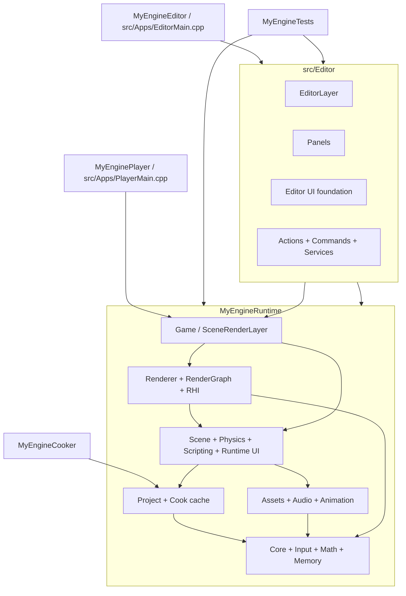

# MyEngine 架构总览

本文档描述当前代码库的高层架构、目标划分、模块依赖和关键运行链路。若本文档与实现不一致，以 `xmake.lua` 和源码为准。

## 构建目标

MyEngine 是一个 C++17、xmake 驱动的游戏引擎仓库。运行时能力集中在 `src/Runtime`，编辑器能力集中在 `src/Editor`，可执行程序负责组合入口和 Layer。

| 目标 | 类型 | 职责 |
| --- | --- | --- |
| `MyEngineRuntime` | shared library, basename `runtime` | 编译 `src/Runtime` 下的核心、资源、场景、物理、脚本、UI、渲染和平台后端。对外公开 `src/Runtime/**/*.h`。 |
| `MyEngineEditor` | binary | 编译 `src/Apps/EditorMain.cpp` 和 `src/Editor`，链接 `MyEngineRuntime`，推入 `SceneRenderLayer` 与 `EditorLayer`。 |
| `MyEnginePlayer` | binary | 编译 `src/Apps/PlayerMain.cpp`，链接 `MyEngineRuntime`，只推入 `SceneRenderLayer`，用于无编辑器运行。 |
| `MyEngineCooker` | binary | 编译发布/烘焙入口和必要的 Editor 发布代码，链接 Runtime，用于生成发布包。 |
| `MyEngineIconTool` | binary | 使用 Runtime 图标服务生成 Editor、Player、Cooker 的平台图标资源。 |
| `MyEngineTests` | binary | 编译 Runtime、Editor 支撑代码和测试套件，覆盖 Core、Assets、Scene、Renderer、Physics、Project、Editor、UI 等路径。 |

第三方依赖由 `xmake.lua` 管理：SDL3、ImGui、nlohmann_json、stb、tinyobjloader、RmlUi、Jolt Physics、AngelScript，以及仓库内置 Lua 和 ImGuizmo。

## 目录边界

```text
MyEngine/
  xmake.lua
  src/
    Apps/
      EditorMain.cpp
      PlayerMain.cpp
      CookerMain.cpp
      IconToolMain.cpp
      EditorPackagerMain.cpp
    Runtime/
      Animation/
      Assets/
      Audio/
      Camera/
      Core/
      Game/
      Input/
      Math/
      Miscs/
      Physics/
      Project/
      Renderer/
      Scene/
      Scripting/
      UI/
    Editor/
      Panels/
      UI/
  tests/
  docs/classes/
```

Runtime 不包含 Editor 头文件。Editor 可以依赖 Runtime public API 和 Game facade，但 Runtime、Renderer、RHI、Player 路径必须在没有 Editor 状态时可用。

## 模块分层

依赖方向按职责从底层到上层组织：

1. **Math**：向量、矩阵、四元数、颜色、射线、AABB 等基础数学类型。
2. **Core / Input**：窗口、事件、主循环、Layer 栈、日志、时间、崩溃处理、内存服务和输入快照/Action Map。
3. **Project**：`MyEngine.project.json`、启动场景、输入配置、图形后端、发布设置、Cook manifest 和运行时包缓存。
4. **Assets / Audio / Animation**：资源句柄、导入、元数据、材质、网格、纹理、脚本资源、音频资源、骨骼动画和蒙皮组件。
5. **Scene / Physics / Scripting / UI**：Actor/Component、序列化、Prefab、Jolt 物理、AngelScript 运行时脚本、RmlUi 运行时 UI。
6. **Renderer / RHI**：渲染器、RenderGraph、Pass、ShaderManager、GPU 上传队列、D3D11/D3D12/Metal 后端。
7. **Game**：`SceneLayer`、`SceneRenderLayer`、Scene/Game viewport、运行时渲染 facade。
8. **Editor**：ImGui 编辑器 shell、项目选择/设置、Panel、Action、Command、Inspector、布局、主题、快捷键和发布 UI。



## 运行主循环

`Application::Run()` 创建窗口并进入 `Engine::RunLoop()`。每帧核心顺序为：

1. `MemoryService::FrameBegin()` 重置帧线性内存。
2. `Time::Tick()` 更新帧时间。
3. 平台事件进入事件队列并刷新 Input 状态。
4. Layer 按栈顺序接收事件和 `OnUpdate(dt)`。
5. Layer 按栈顺序执行 `OnRender()`。
6. 程序退出时 `Engine::Shutdown()` 输出内存统计并关闭服务。

Editor 入口推入 `SceneRenderLayer` 后再推入 `EditorLayer`，并调用 `SceneRenderLayer::SetPresentEnabled(false)`，让 ImGui 在 3D pass 之后绘制并统一 present。Player 入口只推入 `SceneRenderLayer`，设置 `SetPresentEnabled(true)`，由运行时场景层完成 present。

## Scene 与 PlayWorld

`SceneLayer` 拥有独立的 `EditorWorld` 和可选 `PlayWorld`：

- Edit 模式下，编辑、保存、撤销、Inspector、Outliner 操作都作用于 `EditorWorld`。
- `BeginPlay()` 通过 `SceneSerializer` 克隆 `EditorWorld` 生成 `PlayWorld`，运行时模拟只更新 `PlayWorld`。
- `PausePlay()` / `ResumePlay()` / `StepPlay()` 控制 `PlayWorld` 的模拟推进。
- `StopPlay()` 销毁 `PlayWorld` 并回到 `EditorWorld`。
- Scene View 默认渲染 `EditorWorld`，可切换到只读 `PlayWorldInspect`；Game View 使用当前 simulation scene 的主 `CameraComponent`。

Scene 使用 generation-checked handles 和安全点结构变更队列。Actor/Component 创建、销毁、改父子关系、启用状态和组件增删都可以进入队列，在安全点统一 flush。详细类级说明见 `docs/classes/scene/ActorLifecycle.md`。

## Viewport 与渲染

`SceneRenderLayer` 是 Runtime/Game facade，组合：

- `SceneViewport`：编辑视口，拥有自由飞行相机、屏幕射线、picking、gizmo 和投影视图控制。
- `GameViewport`：运行预览视口，从当前 scene 查找主 `CameraComponent`，缺失时使用 fallback camera。
- `ViewportRenderExecution`：为不同 viewport 管理 renderer、offscreen 输出和纹理视图。
- `UISystem`：收集 RmlUi 运行时 UI draw list，并交给 Renderer 的 `ScreenUIPass`。

Renderer 运行在拆分后的 RHI 接口之上：

```text
Renderer
  -> RenderGraph
    -> IRHIDevice / IRHIFrameContext / IRHIReadbackService
      -> D3D11Context / D3D12Context / MetalContext
```

`IRenderContext` 仍作为兼容 facade 存在，新后端无关功能应优先使用拆分接口。RenderGraph 负责 pass 依赖验证、资源导入、final state、子资源访问、保守 pass culling 和 descriptor-keyed transient reuse。D3D 原生类型限制在后端实现文件中，边界检查由 `tools/check-rhi-boundaries.ps1` 负责。

渲染 pass 当前包括 Shadow、Environment、Main、SSAO、Blur、Composite 和 ScreenUI。Windows 支持 D3D11/D3D12，macOS 支持 Metal，Linux 当前只有平台宏，没有仓库内 GPU 后端实现。

## Runtime UI

`src/Runtime/UI` 集成 RmlUi，用于游戏内 retained-mode UI。入口组件是 `UICanvasComponent`：

- `AssetDocument` 模式加载项目相对 RML、RCSS 和 font 路径。
- `ActorTree` 模式把 Scene Actor 子树作为可编辑 UI 层级，并生成内存 RML document。
- `UISystem` 负责 RmlUi 初始化、context 更新、输入转发、字体加载、actor-tree reload 和 draw-list 收集。
- `RmlRenderInterface` 把 RmlUi geometry 上传到 RHI buffer/texture。
- `Renderer` 在 RenderGraph 末尾追加 `ScreenUIPass`，把 UI 绘制到 backbuffer 或 offscreen viewport target。

Editor 仍是 ImGui 编辑器；它只负责 Runtime UI 资源和组件的作者工具暴露，不把 RmlUi 用作编辑器 UI。

## Editor 架构

`EditorLayer` 是编辑器 shell，负责 ImGui 生命周期、顶层菜单/状态栏、项目选择、项目设置、服务注册、Panel 调度和平台文件对话框结果转发。业务能力拆在更小的对象中：

- `EditorContext`：聚合 scene layer、render context、window、engine、selection、command stack、project、asset registry、actions 和 typed services。
- `EditorActionRegistry`：统一菜单、工具栏、快捷键和命令启用条件。
- `EditorCommandStack`：管理会修改 scene 的 undo/redo 事务。
- `EditorServiceCollection`：注册日志、对话框、导入、Lua editor script、shader watch 等服务。
- `EditorPanel` 派生类：Toolbar、Scene Hierarchy、Scene View、Game View、Inspector、Asset Browser、Log。
- `EditorLayoutManager`：根据 `Config/EditorLayout.default.json` 构建 DockSpace；用户布局写入 editor workspace，不污染 scene。
- `EditorInspectorRegistry`：注册组件 Inspector section，保持组件 UI 与 undo/redo 语义一致。
- `src/Editor/UI`：UI scale、font、theme token、widgets、property grid、notification、status bar。

会修改场景的编辑器操作必须进入 command stack 或既有 scene transaction。布局、主题、UI 缩放、快捷键、recent projects 等编辑器偏好只写入 workspace，不标记 scene dirty。

## Project、Cook 与发布

`ProjectConfig` 是 Runtime 服务，Editor 与 Player 共用：

- 项目根目录包含 `MyEngine.project.json`。
- `startupScene`、输入配置、发布输出和图形后端都以项目相对路径/配置保存。
- Editor 可通过项目设置指定启动场景、输入配置、图形后端和发布输出。
- Player 从项目配置加载 `startupScene`，也可由 `--project` 和 `--scene` 覆盖。
- `ProjectPublisher` 与 `MyEngineCooker` 生成 Windows x64 发布包，包含 Player/runtime binaries、`Content.pak`、`CookManifest.json` 和项目 manifest。
- `CookedProjectCache` 以 manifest 和 archive hash 验证、安装或修复运行时缓存。

发布和烘焙路径不能依赖 Editor workspace 状态；新序列化资源引用应优先使用项目相对路径，旧绝对路径可继续兼容读取。

## Runtime 子系统约定

- **Memory**：`MemoryService` 统一堆分配、帧线性分配、统计、tracking、guard 和 scene actor budget。选项由 `mem_stats`、`mem_tracking`、`mem_guard` 控制。
- **Physics**：Jolt 5.5.0 隐藏在 `PhysicsWorld` PImpl 后面。Jolt 头文件和句柄不得泄漏到 Scene、Editor、Lua/AngelScript 绑定外层接口。
- **Gameplay / Navigation**：`Health/Hitbox/Interaction/EnemyAI` 与
  `NavigationWorld/NavAgent` 位于 Runtime。NavMesh 和 Particle 使用可发布的
  `.navmesh` / `.particle` 资产；Editor 只负责烘焙和 Inspector，不拥有运行时状态。
- **Scene flow**：`SceneManager` 后台读取场景文件，在主线程 safe update 完成反序列化
  和替换，失败时保留当前场景，并保存跨场景 JSON 参数。正式存档由版本化 `SaveGame` 原子写入。
- **Scripting**：运行时 gameplay 脚本使用 AngelScript，`ScriptComponent` 反射可编辑字段并序列化参数。Lua 只用于 Editor automation/tooling，不进入 Player 运行时脚本路径。
- **Assets**：`AssetManager` 管理资源注册、加载、缓存和内存估算；导入器与 `.meta` 文件负责稳定资源身份。
- **Icons**：`IconsManager` 是 Runtime SVG 图标服务，Editor UI 通过 `EditorWidgets` 消费图标纹理，Player/Runtime 不依赖 Editor 头文件。

## 数学与渲染约定

- `Mat4` 为 row-major。
- 坐标系为 left-handed，Y-up。
- D3D 深度范围为 0..1。
- HLSL 使用 `mul(vector, matrix)` 风格。
- 变换层级遵守 `world = local * parentWorld`，因此编辑器 gizmo 写回局部变换时使用 `local = world * inverse(parentWorld)`。

更细的数学约定见 `docs/rendering-math-conventions.md`。

## 文档维护

- 修改模块边界、目标组成、Runtime/Editor 依赖方向、Frame/Render 生命周期时，同步更新本文档。
- 修改具体类契约时，同步更新 `docs/classes/` 中对应类文档。
- `CLAUDE.md` 保持为快速构建/运行/约定入口；完整架构说明以本文档和 `design.md` 为准。
